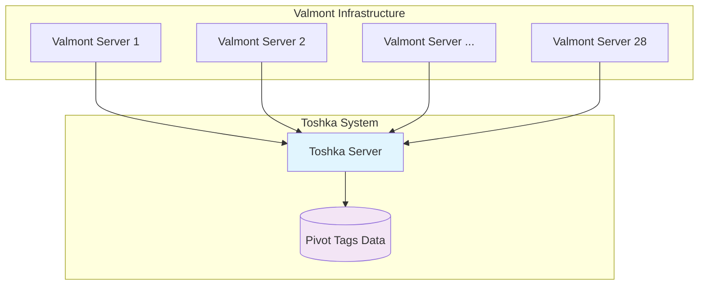
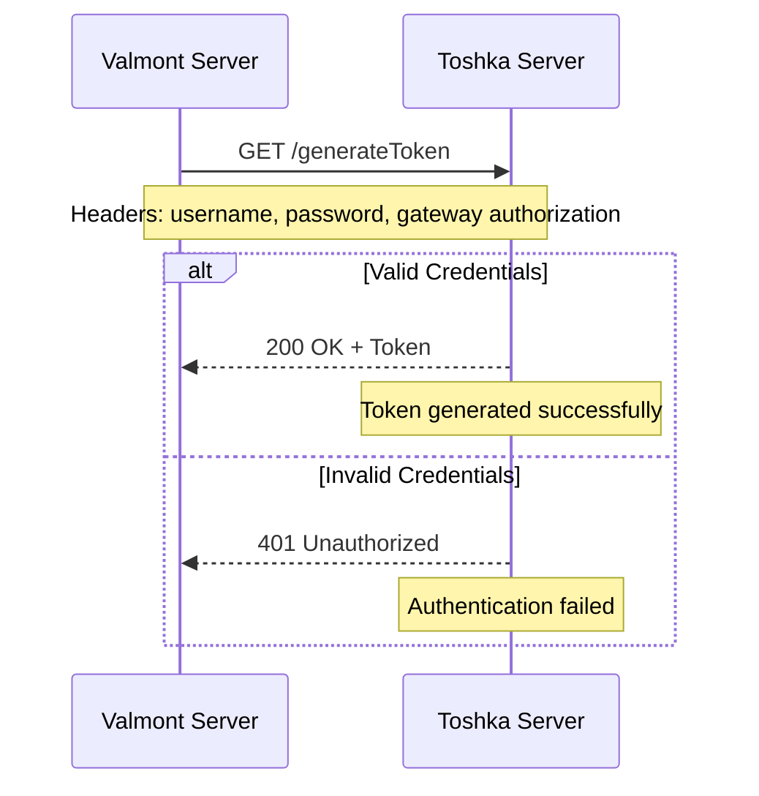
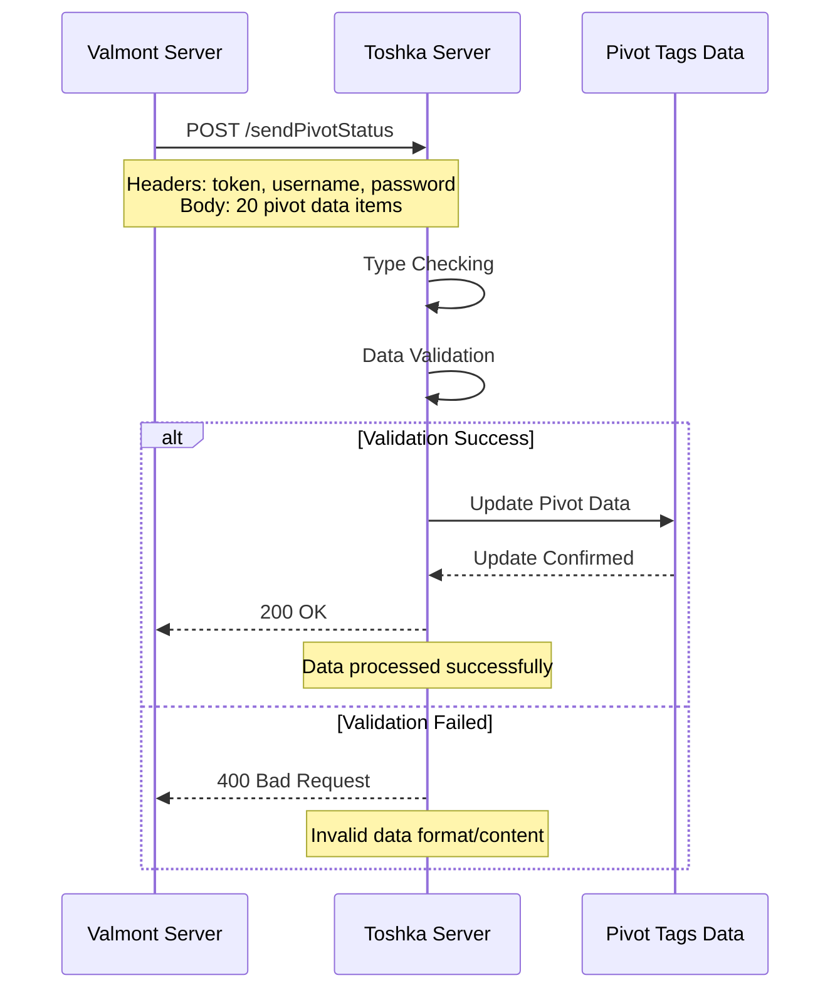
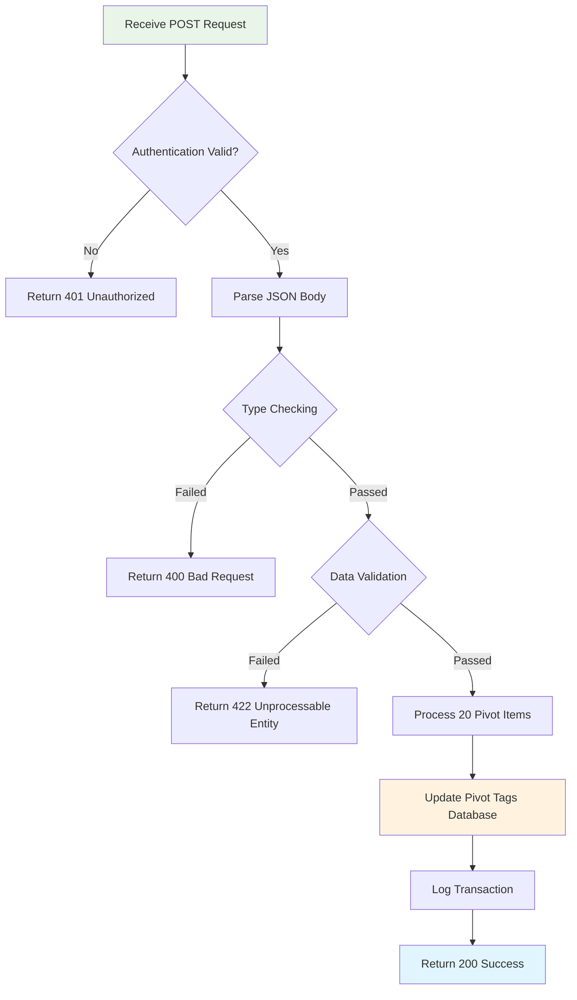
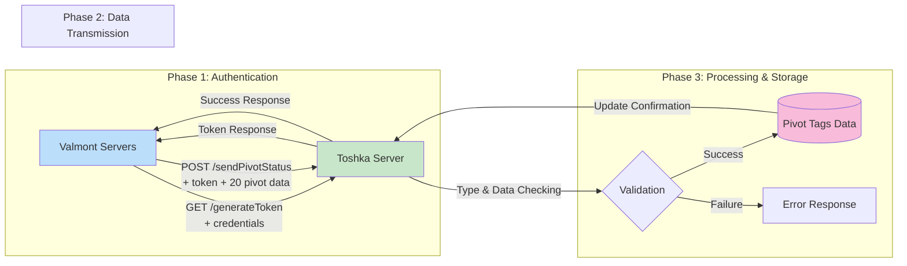

# Valmont-Toshka API Workflow Documentation

## Overview

This document describes the API workflow between **Valmont 28 Servers**, **Toshka Server**, and **Pivot Tags Data** system for pivot irrigation management.

## System Architecture



## API Workflow Process

### Step 1: Token Generation 🔐

**Valmont Servers → Toshka Server**



**Request Details:**
- **Method:** `GET`
- **Endpoint:** `/generateToken`
- **Headers:**
  ```http
  Authorization: Gateway [auth_token]
  username: [valmont_username]
  password: [valmont_password]
  ```

**Response:**
```json
{
  "token": "eyJhbGciOiJIUzI1NiIsInR5cCI6IkpXVCJ9...",
  "expires_in": 3600,
  "token_type": "Bearer"
}
```

---

### Step 2: Pivot Data Transmission 📡

**Valmont Servers → Toshka Server**



**Request Details:**
- **Method:** `POST`
- **Endpoint:** `/sendPivotStatus`
- **Headers:**
  ```http
  Authorization: Bearer [token_from_step1]
  username: [valmont_username]
  password: [valmont_password]
  Content-Type: application/json
  ```

**Request Body Structure:**
```json
{
  "pivots": [
    {
      "pivot_id": "PVT001",
      "status": "active",
      "position": 45.7,
      "water_pressure": 2.3,
      "flow_rate": 150.5,
      "temperature": 23.4,
      "humidity": 68.2,
      "soil_moisture": 35.8,
      "battery_level": 87,
      "signal_strength": -65,
      "last_maintenance": "2024-05-15T10:30:00Z",
      "operational_hours": 1250.5,
      "error_codes": [],
      "gps_coordinates": {
        "latitude": 40.7128,
        "longitude": -74.0060
      },
      "irrigation_schedule": {
        "start_time": "06:00",
        "duration": 120,
        "frequency": "daily"
      },
      "water_consumption": 1250.75,
      "energy_consumption": 45.2,
      "maintenance_required": false,
      "firmware_version": "v2.1.3",
      "timestamp": "2024-06-04T14:30:00Z"
    }
    // ... 19 more pivot objects
  ]
}
```

---

### Step 3: Data Processing & Storage 💾

**Toshka Server → Pivot Tags Data**



**Data Processing Steps:**

1. **Type Checking:**
   - Validate JSON structure
   - Check data types for each field
   - Ensure required fields are present

2. **Data Validation:**
   - Range validation (e.g., pressure, temperature)
   - Format validation (e.g., timestamps, coordinates)
   - Business logic validation

3. **Database Update:**
   - Update existing pivot records
   - Create new records if pivot doesn't exist
   - Maintain data history and audit trail

---

## Complete Workflow Diagram



## API Endpoints Summary

| Endpoint | Method | Purpose | Authentication |
|----------|--------|---------|----------------|
| `/generateToken` | GET | Generate access token | Gateway + Username/Password |
| `/sendPivotStatus` | POST | Send pivot data batch | Token + Username/Password |

## Error Handling

### Common HTTP Status Codes

- **200 OK** - Request successful
- **400 Bad Request** - Invalid request format
- **401 Unauthorized** - Authentication failed
- **403 Forbidden** - Insufficient permissions
- **422 Unprocessable Entity** - Data validation failed
- **500 Internal Server Error** - Server processing error

### Error Response Format

```json
{
  "error": {
    "code": "VALIDATION_FAILED",
    "message": "Data validation failed for pivot PVT001",
    "details": [
      {
        "field": "water_pressure",
        "issue": "Value out of acceptable range (0-10 bar)"
      }
    ],
    "timestamp": "2024-06-04T14:30:00Z"
  }
}
```

## Security Considerations

- **Multi-layer Authentication:** Gateway authorization + username/password + token
- **Token Expiration:** Tokens have limited lifetime for security
- **Data Validation:** Comprehensive checking prevents injection attacks
- **Audit Logging:** All transactions are logged for monitoring

## Performance Metrics

- **Batch Size:** 20 pivot data items per request
- **Server Capacity:** Supports 28 concurrent Valmont servers
- **Data Processing:** Real-time validation and storage
- **Response Time:** < 500ms average for successful requests

---

## Implementation Notes

### For Developers

1. **Rate Limiting:** Consider implementing rate limiting for the API endpoints
2. **Monitoring:** Set up monitoring for failed authentication attempts
3. **Backup:** Ensure regular backups of Pivot Tags Data
4. **Scaling:** Architecture supports horizontal scaling of Toshka servers

### Configuration Requirements

- Database connection pool sizing for concurrent requests
- Token expiration time configuration
- Data validation rules configuration
- Error logging and alerting setup

---

*Last Updated: June 4, 2025*
*Version: 1.0*
