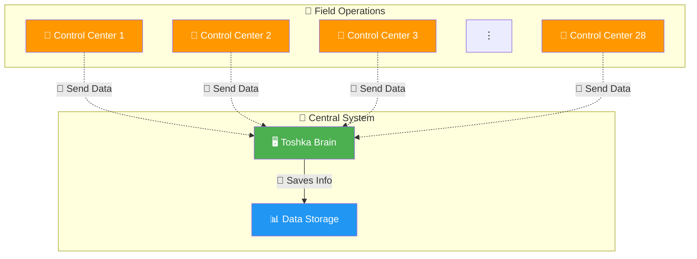
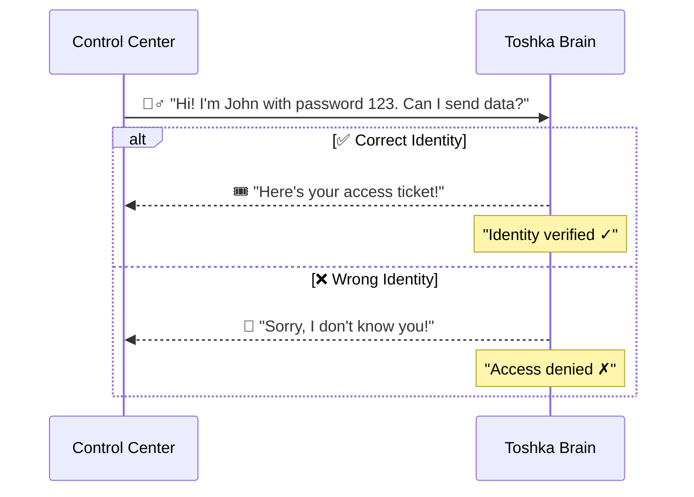
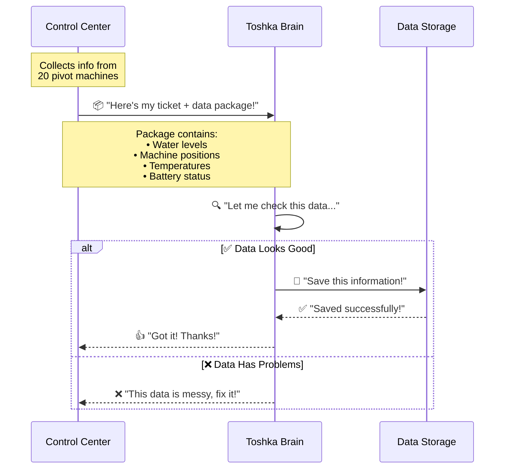
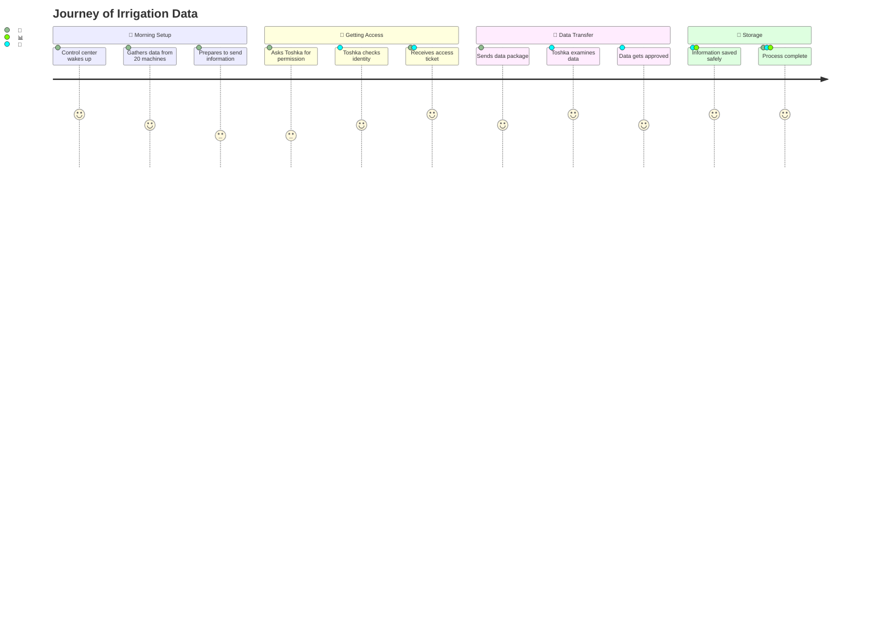
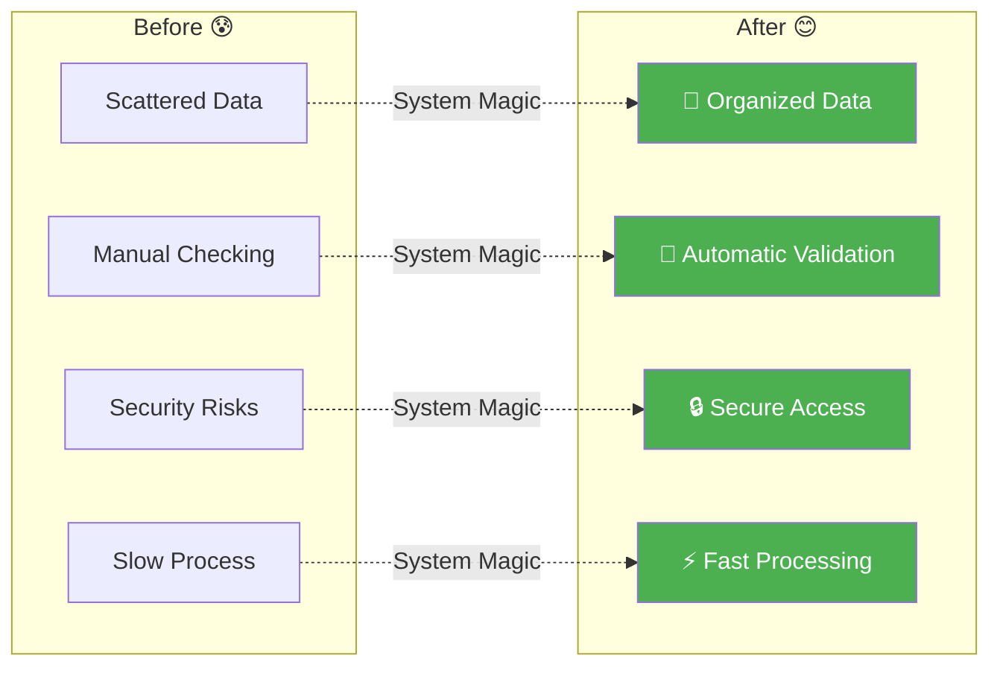

# 🌾 Valmont-Toshka Irrigation System: How It Works

## 🎯 What This System Does

Imagine **28 irrigation control centers** (Valmont servers) that need to send important information about **pivot irrigation systems** to a central brain (Toshka server) that stores and manages all the data.

---

## 🏗️ The Big Picture



---

## 🔄 The 3-Step Process

### Step 1️⃣: Getting Permission 🔐



**What Happens:**
- 🏢 Control center says: *"I'm [username] with password [password], let me in!"*
- 🧠 Toshka checks: *"Do I know this person?"*
- ✅ If yes: *"Here's your temporary access ticket!"*
- ❌ If no: *"Go away, stranger!"*

---

### Step 2️⃣: Sending the Data 📦



**What Happens:**
- 🏢 Control center: *"Here's data from 20 irrigation machines + my access ticket"*
- 🧠 Toshka: *"Let me check if this data makes sense..."*
- 🔍 **Checking process:** Is the temperature reasonable? Are coordinates valid? Is battery level between 0-100%?
- ✅ If good: *"Perfect! I'll save this."*
- ❌ If bad: *"Something's wrong here, try again."*

---

### Step 3️⃣: Smart Data Processing 🤖

```mermaid
flowchart TD
    A[📦 Data Package Arrives] --> B{🎟️ Valid Ticket?}
    B -->|❌ No| C[🚫 Reject Package]
    B -->|✅ Yes| D[📋 Open Package]
    
    D --> E{🔍 Data Check 1:<br/>Right Format?}
    E -->|❌ No| F[❌ "Package is damaged"]
    E -->|✅ Yes| G{🔍 Data Check 2:<br/>Makes Sense?}
    
    G -->|❌ No| H[❌ "Data is weird"]
    G -->|✅ Yes| I[🔄 Process 20 Machine Reports]
    
    I --> J[💾 Update Database]
    J --> K[📝 Log Activity]
    K --> L[✅ "All Done!"]
    
    style A fill:#FFF3E0
    style L fill:#E8F5E8
    style J fill:#E3F2FD
    style C fill:#FFEBEE
    style F fill:#FFEBEE
    style H fill:#FFEBEE
```

**What Happens:**
1. 🎟️ **Ticket Check:** *"Is this person allowed to be here?"*
2. 📋 **Package Opening:** *"Let's see what's inside..."*
3. 🔍 **Format Check:** *"Is this organized properly?"*
4. 🤖 **Smart Check:** *"Do these numbers make sense? Temperature of 200°C? That's impossible!"*
5. 💾 **Save Data:** *"Everything looks good, storing information..."*
6. 📝 **Keep Records:** *"Writing down what happened for future reference"*

---

## 🎭 The Complete Story



---

## 🌟 Why This Process is Smart

### 🔒 **Security First**
- Like a **VIP club** - you need proper ID and a special ticket to enter
- **Double-checking identity** ensures only authorized centers can send data

### 🧠 **Smart Validation**
- Like having a **quality inspector** who catches mistakes
- **Automatic checking** prevents bad data from corrupting the system

### ⚡ **Efficient Processing**
- **Batch processing** of 20 machines at once (like processing a whole tray of cookies instead of one at a time)
- **28 control centers** can all work simultaneously without conflicts

### 📊 **Organized Storage**
- All irrigation data stored in **one central place**
- Easy to find, update, and analyze information

---

## 🎯 The End Result



**🎉 Success!** Now farmers and managers can trust that their irrigation data is:
- ✅ **Secure** and protected
- ✅ **Accurate** and reliable  
- ✅ **Organized** and accessible
- ✅ **Up-to-date** and current

---

> *"Like having a super-organized assistant who never makes mistakes and works 24/7 to keep your irrigation data perfect!"* 🌾✨
